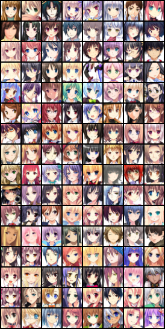
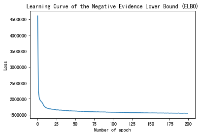
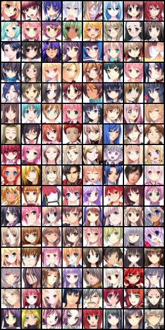
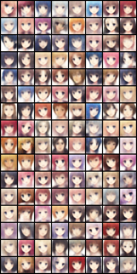
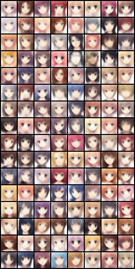

# Variational Autoencoder(VAE) for image reconstruction by the animation faces dataset

In this VAE example, I use five ConvNets for the encoder and decoder networks. 
## Encoder
This defines the approximate posterior distribution $q(z|x)$, which takes as input an observation and outputs a set of parameters for specifying the conditional distribution of the latent representation $z$. In this example, simply model the distribution as a diagonal Gaussian, and the network outputs the mean and log-variance parameters of a factorized Gaussian. Output log-variance instead of the variance directly for numerical stability.
## Decoder
This defines the conditional distribution of the observation $q(x|z)$, which takes a latent sample  as input and outputs the parameters for a conditional distribution of the observation. Model the latent distribution prior $p(z)$ as a unit Gaussian.
## Reparameterization trick
To generate a sample $z$ for the decoder during training, you can sample from the latent distribution defined by the parameters outputted by the encoder, given an input observation $x$. However, this sampling operation creates a bottleneck because backpropagation cannot flow through a random node.

To address this, use a reparameterization trick. In our example, you approximate $z$ using the decoder parameters and another parameter $\epsilon$ as follows:

$$z = \mu + \sigma \odot \epsilon$$
where $\mu$ and $\sigma$ represent the mean and standard deviation of a Gaussian distribution respectively. They can be derived from the decoder output. The $\epsilon$ can be thought of as a random noise used to maintain stochasticity of $z$. Generate $\epsilon$ from a standard normal distribution.

The latent variable $z$ is now generated by a function of $\mu$, $\sigma$ and $\epsilon$, which would enable the model to backpropagate gradients in the encoder through $\mu$ and $\sigma$ respectively, while maintaining stochasticity through $\epsilon$.
## Loss function
Original distribution $P(x)$:
$$P(x) = \int_{z} P(z)P(x|z)dz$$
And we hope $P(x)$ the bigger the better, then
$$\text{Maximum} \ L = \sum_{x} \text{log}P(x)$$
where
$$ \text{log}P(x) =  \int_{z} q(z|x)\text{log}P(x)dz$$
$$=\int_{z} q(z|x)\text{log}\left \(\frac{P(z,x)}{P(z|x)}\right )dz$$
$$=\int_{z} q(z|x)\text{log}\left \(\frac{P(z,x)}{q(z|x)}\frac{q(z|x)}{P(z|x)}\right )dz$$
$$=\int_{z} q(z|x)\text{log}\left \(\frac{P(z,x)}{q(z|x)}\right )dz + \int_{z} q(z|x)\text{log}\left \(\frac{q(z|x)}{P(z|x)}\right )dz$$
$$=\int_{z} q(z|x)\text{log}\left \(\frac{P(z,x)}{q(z|x)}\right )dz + KL \left \(q(z|x)||P(z|x)\right )$$
The second term of the above formula is a value greater than or equal to 0, so we found a lower bound of $\text{log}P(x)$
$$\text{log}P(x) \geq \int_{z} q(z|x)\text{log}\left \(\frac{P(x|z)P(z)}{q(z|x)}\right )dz$$
We denote this lower bound as $\text{ELBO}$:
$$\text{log} P(x) \geq \text{ELBO} = \int_{z} q(z|x)\text{log}\left \(\frac{P(x|z)P(z)}{q(z|x)}\right )dz = \text{E}_{q(z|x)}\left \[ \text{log}\frac{p(x,z)}{q(z|x)} \right ]$$
So we can revise the original form as:
$$ \text{log}P(x) =  \text{ELBO} + KL \left \(q(z|x)||P(z|x)\right )$$
When we fix $P(x|z)$, because $logP(x)$ is only related to $P(x|z)$, the value of $logP(x)$ will not change. At this time, we adjust $q(z|x)$, making $\text{ELBO}$ higher and higher, while KL divergence is getting smaller and smaller, when we adjust to $q(z|x)$ and $P(z|x)$ are exactly the same, KL divergence disappears to 0, $\text{ELBO}$ and $logP (x)$ are fully consistent. It can be concluded that regardless of the value of $logP(x)$, we can always adjust $\text{ELBO}$ to be equal to $logP(x)$, and because $\text{ELBO}$ is the lower bound of $logP(x)$, solving for Maximum $logP(x)$ is equivalent to solving Maximum $\text{ELBO}$
Adjusting $P(x|z)$ is adjusting the Decoder, and adjusting $q(z|x)$ is adjusting the Encoder.

Every time the decoder advances, the Encoder is adjusted to be consistent with it, so that the decoder will only be better after next training epoch.
$$\text{ELBO} = \int_{z} q(z|x)\text{log}\left \(\frac{P(z,x)}{q(z|x)}\right )dz$$
$$=\int_{z} q(z|x)\text{log}\left \(\frac{P(x|z)P(z)}{q(z|x)}\right )dz$$
$$=\int_{z} q(z|x)\text{log}\left \(\frac{P(z)}{q(z|x)}\right )dz+\int_{z} q(z|x)\text{log}P(x|z)dz$$
$$=-KL \left \( q(z|x)||P(z)\right )+\int_{z} q(z|x)\text{log}P(x|z)dz$$
Therefore, maximize $\text{ELBO}$ is equivalent to minimize $KL \left \( q(z|x)||P(z)\right )$ and maximize $\int_{z} q(z|x)\text{log}P(x|z)dz$. Let's check the first term. In fact, the expansion of $-KL \left \( q(z|x)||P(z)\right )$ is exactly equal to:
$$\sum_{i=1}^{J}\left \( exp(\sigma_{i})-(1-\sigma_{i})+(\mu_{i})^2\right )$$
Next, check the second term
$$\text{Maximum}\int_{z} q(z|x)\text{log}P(x|z)dz$$
$$=\text{Maximum}\\text{E}_{q(z|x)}\left \[ \text{log}q(x|z) \right ]$$
The above expectation means P(x|z) (Decoder's output) given that q(z|x) (Encoder's output) is as high as possible. This is similar to AutoEncoder's loss function(reconstruction error):
$$(x-x^{'})^2$$
### Data Set
Image from https://drive.google.com/file/d/19YL_FCG3dURkiFUuq1mv8BBZH0jPWTj_/view

Original Image:

### Training
Learning Curve of the Negative Evidence Lower Bound (ELBO):

### Reconstruction samples using VAE
Sample Image:

Reconstruct Image:

### Sample the prior p(z) and use the latent codes z to synthesize some examples

### Synthesized images based on the interpolation of two latent codes z between two real samples

